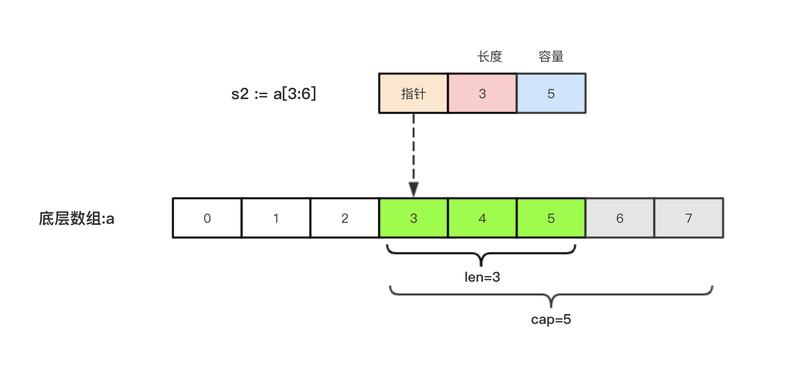

## 引子
因为数组的长度是固定的并且数组长度属于类型的一部分，所以数组有很多的局限性。 例如：
```
func arraySum(x [3]int) int{
    sum := 0
    for _, v := range x{
        sum = sum + v
    }
    return sum
}
```
这个求和函数只能接受[3]int类型，其他的都不支持。 再比如，
```
a := [3]int{1, 2, 3}
```
数组a中已经有三个元素了，我们不能再继续往数组a中添加新元素了。

## 切片
## 1. 切片的定义
切片就是一个框，框住了一块连续的内存。
- 1. 切片指向了一个底层的数组。
- 2. 切片的长度就是它元素的个数
- 3. 切片的容量是底层数组从切片的第一个元素到最后一个元素的数量
- 4. 切片是一个引用类型，都指向了底层的一个数组。
例如：
```
a1 := [...]int{1, 3, 5, 7, 9, 11, 13}

// *切片的容量是指底层数组的容量
fmt.Println(cap(s3))                                    // s3 的容量 7
fmt.Printf("len(s3):%d cap(s3):%d\n", len(s3), cap(s3)) // len(s3):4 cap(s3):7

s4 := a1[3:]           									// [7 9 11 13]                         
// 底层数组从切片的第一个元素到最后的元素数量
fmt.Println(cap(s4))                                    // s4 的容量 4
fmt.Printf("len(s4):%d cap(s4):%d\n", len(s4), cap(s4)) // len(s4):4 cap(s4):4

// 切片再切片
s5 := s4[3:]
fmt.Printf("len(s5):%d cap(s5):%d\n", len(s5), cap(s5)) // len(s5):1 cap(s5):1

// 切片是引用类型，都指向了底层的一个数组。
// s4
fmt.Println("s4 ", s4)   // s4  [7 9 11 13]
a1[6] = 1300 // 修改了底层数组的值 
fmt.Println("s4 ", s4) 	 // s4  [7 9 11 1300]

```

切片（Slice）是一个拥有相同类型元素的可变长度的序列。它是基于数组类型做的一层封装。它非常灵活，支持自动扩容。

切片是一个引用类型，它的内部结构包含地址、长度和容量。切片一般用于快速地操作一块数据集合。

声明切片类型的基本语法如下：
```
var name []T
```
其中，

- name:表示变量名
- T:表示切片中的元素类型
举个例子：
```
func main() {
	// 切片的定义
	var s1 []int    // 定义一个存放int类型元素的切片
	var s2 []string // 定义一个存放string类型元素的切片
	fmt.Println(s1, s2)

	// 空 在go表示 你没有开辟内存空间
	fmt.Println(s1 == nil) // true
	fmt.Println(s2 == nil) // true

	//初始化
	s1 = []int{1, 2, 3}
	s2 = []string{"陕西", "江苏", "浙江"}

	fmt.Println(s1 == nil) // false
	fmt.Println(s2 == nil) // false
}
```

## 2. 切片的长度和容量
切片拥有自己的长度和容量，我们可以通过使用内置的len()函数求长度，使用内置的cap()函数求切片的容量。
```
//初始化
s1 = []int{1, 2, 3}
s2 = []string{"陕西", "江苏", "浙江"}

    //长度和容量
fmt.Printf("len(s1):%d cap(s1):%d\n", len(s1), cap(s1))
fmt.Printf("len(s1):%d cap(s1):%d\n", len(s2), cap(s2))

```

## 3. 切片表达式
切片表达式从字符串、数组、指向数组或切片的指针构造子字符串或切片。它有两种变体：一种指定low和high两个索引界限值的简单的形式，另一种是除了low和high索引界限值外还指定容量的完整的形式。

## 4. 简单切片表达式
切片的底层就是一个数组，所以我们可以基于数组通过切片表达式得到切片。 切片表达式中的low和high表示一个索引范围（左包含，右不包含），也就是下面代码中从数组a中选出1<=索引值<4的元素组成切片s，得到的切片长度=high-low，容量等于得到的切片的底层数组的容量。

- 注意：

对于数组或字符串，如果0 <= low <= high <= len(a)，则索引合法，否则就会索引越界（out of range）。

对切片再执行切片表达式时（切片再切片），high的上限边界是切片的容量cap(a)，而不是长度。常量索引必须是非负的，并且可以用int类型的值表示;对于数组或常量字符串，常量索引也必须在有效范围内。如果low和high两个指标都是常数，它们必须满足low <= high。如果索引在运行时超出范围，就会发生运行时panic。

## 5. 完整切片表达式
对于数组，指向数组的指针，或切片a(注意不能是字符串)支持完整切片表达式：

```a[low : high : max]```

上面的代码会构造与简单切片表达式a[low: high]相同类型、相同长度和元素的切片。另外，它会将得到的结果切片的容量设置为max-low。在完整切片表达式中只有第一个索引值（low）可以省略；它默认为0。
```
func main() {
	a := [5]int{1, 2, 3, 4, 5}
	t := a[1:3:5]
	fmt.Printf("t:%v len(t):%v cap(t):%v\n", t, len(t), cap(t))
}

输出结果：
t:[2 3] len(t):2 cap(t):4

```
完整切片表达式需要满足的条件是0 <= low <= high <= max <= cap(a)，其他条件和简单切片表达式相同。

## 6. 使用make()函数构造切片
我们上面都是基于数组来创建的切片，如果需要动态的创建一个切片，我们就需要使用内置的make()函数，格式如下：
```make([]T, size, cap)```
其中：

- T:切片的元素类型
- size:切片中元素的数量
- cap:切片的容量
举个例子：

// make()函数创造切片
func main() {
	s1 := make([]int, 5, 10) // 如果 去掉10则 len(s1)=5 cap(s1)=5

	// s1=[0 0 0 0 0] len(s1)=5 cap(s1)=10
	fmt.Printf("s1=%v len(s1)=%d cap(s1)=%d\n", s1, len(s1), cap(s1))

	s2 := make([]int, 0, 10)

	// s2=[] len(s2)=0 cap(s2)=10
	fmt.Printf("s2=%v len(s2)=%d cap(s2)=%d\n", s2, len(s2), cap(s2)) //
}

上面代码中a的内部存储空间已经分配了10个，但实际上只用了5个。 容量并不会影响当前元素的个数，所以len(a)返回5，cap(a)则返回该切片的容量。

## 7. 切片的本质
切片的本质就是对底层数组的封装，它包含了三个信息：底层数组的指针、切片的长度（len）和切片的容量（cap）。

举个例子，现在有一个数组a := [8]int{0, 1, 2, 3, 4, 5, 6, 7}，切片s1 := a[:5]，相应示意图如下。


切片s2 := a[3:6]，相应示意图如下：


## 8. 判断切片是否为空
要检查切片是否为空，请始终使用len(s) == 0来判断，而不应该使用s == nil来判断。

## 9. 切片不能直接比较
- 切片之间是不能比较的，我们不能使用==操作符来判断两个切片是否含有全部相等元素。 
- 切片唯一合法的比较操作是和nil比较。 
- 一个nil值的切片并没有底层数组，一个nil值的切片的长度和容量都是0。但是我们不能说一个长度和容量都是0的切片一定是nil。
例如下面的示例：
```
var s1 []int         //len(s1)=0;cap(s1)=0;s1==nil
s2 := []int{}        //len(s2)=0;cap(s2)=0;s2!=nil
s3 := make([]int, 0) //len(s3)=0;cap(s3)=0;s3!=nil
```
注意：
- 所以要判断一个切片是否是空的，要是用len(s) == 0来判断，不应该使用s == nil来判断。

## 10. 切片的赋值拷贝
下面的代码中演示了拷贝前后两个变量共享底层数组，对一个切片的修改会影响另一个切片的内容，这点需要特别注意。
```
// 切片的赋值
s3 := []int{1, 2, 3}
s4 := s3 // s3 和 s4都指向了同一个底层数组
fmt.Println(s4)
s3[0] = 1000
fmt.Println(s3, s4)
```

## 11. 切片遍历
切片的遍历方式和数组是一致的，支持索引遍历和for range遍历。

```
	// 切片的遍历
	// 1. 索引遍历
	for i := 0; i < len(s3); i++ {
		fmt.Println(s3[i])
	}

	// 2. for range 循环
	for i, v := range s3 {
		fmt.Println(i, v)
	}
```

## 12. append()方法为切片添加元素
Go语言的内建函数append()可以为切片动态添加元素。 可以一次添加一个元素，可以添加多个元素，也可以添加另一个切片中的元素（后面加…）。

每个切片会指向一个底层数组，这个数组的容量够用就添加新增元素。当底层数组不能容纳新增的元素时，切片就会自动按照一定的策略进行“扩容”，此时该切片指向的底层数组就会更换。“扩容”操作往往发生在append()函数调用时，所以我们通常都需要用原变量接收append函数的返回值。
```
// append() 为切片的追加元素

func main() {
	s1 := []string{"北京", "上海", "深圳"}
	fmt.Printf("s1=%v len(s1)=%d cap(s1)=%d\n", s1, len(s1), cap(s1))
	// s1[3] = "陕西" 错误的写法 会导致编译错误，索引越界
	// fmt.Println(s1)

	// 调用append函数必须用原来的切片变量接收返回值
	// append追加元素，原来的底层数组放不下的时候，Go底层就会把底层数组换一个
	// 必须用变量接收append的返回值
	s1 = append(s1, "陕西")
	fmt.Printf("s1=%v len(s1)=%d cap(s1)=%d\n", s1, len(s1), cap(s1))

	s1 = append(s1, "南京", "成都")
	fmt.Printf("s1=%v len(s1)=%d cap(s1)=%d\n", s1, len(s1), cap(s1))

	s2 := []string{"武汉", "西安", "苏州"}

	s1 = append(s1, s2...) // ...标示拆开
	fmt.Printf("s1=%v len(s1)=%d cap(s1)=%d\n", s1, len(s1), cap(s1))
}

```

从上面的结果可以看出：

- 1. append()函数将元素追加到切片的最后并返回该切片。
- 2. 切片numSlice的容量按照1，2，4，8，16这样的规则自动进行扩容，每次扩容后都是扩容前的2倍。
- 3. append()函数还支持一次性追加多个元素。

## 13. 切片的扩容策略
可以通过查看$GOROOT/src/runtime/slice.go源码，其中扩容相关代码如下：
```
newcap := old.cap
doublecap := newcap + newcap
if cap > doublecap {
	newcap = cap
} else {
	if old.len < 1024 {
		newcap = doublecap
	} else {
		// Check 0 < newcap to detect overflow
		// and prevent an infinite loop.
		for 0 < newcap && newcap < cap {
			newcap += newcap / 4
		}
		// Set newcap to the requested cap when
		// the newcap calculation overflowed.
		if newcap <= 0 {
			newcap = cap
		}
	}
}
```
从上面的代码可以看出以下内容：
- 首先判断，如果新申请容量（cap）大于2倍的旧容量（old.cap），最终容量（newcap）就是新申请的容量（cap）。
- 否则判断，如果旧切片的长度小于1024，则最终容量(newcap)就是旧容量(old.cap)的两倍，即（newcap=doublecap），
- 否则判断，如果旧切片长度大于等于1024，则最终容量（newcap）从旧容量（old.cap）开始循环增加原来的1/4，即（newcap=old.cap,for {newcap += newcap/4}）直到最终容量（newcap）大于等于新申请的容量(cap)，即（newcap >= cap）
- 如果最终容量（cap）计算值溢出，则最终容量（cap）就是新申请容量（cap）。
需要注意的是，切片扩容还会根据切片中元素的类型不同而做不同的处理，比如int和string类型的处理方式就不一样。


## 14. 使用copy()函数复制切片
```
// copy

func main() {
	a1 := []int{1, 3, 5}
	a2 := a1 // 赋值
	var a3 = make([]int, 3, 5)
	copy(a3, a1) // copy
	fmt.Println(a1, a2, a3) //[1 3 5] [1 3 5] [1 3 5]
	a1[0] = 100
	fmt.Println(a1, a2, a3) //[100 3 5] [100 3 5] [1 3 5]
}
```

由于切片是引用类型，所以a和b其实都指向了同一块内存地址。修改b的同时a的值也会发生变化。

Go语言内建的copy()函数可以迅速地将一个切片的数据复制到另外一个切片空间中，copy()函数的使用格式如下：

```copy(destSlice, srcSlice []T)```

其中：
- srcSlice: 数据来源切片
- destSlice: 目标切片

## 15. 从切片中删除元素
Go语言中并没有删除切片元素的专用方法，我们可以使用切片本身的特性来删除元素。 代码如下：
```
	// 将a1中的索引为1的3这个元素删掉
	a1 = append(a1[:1], a1[2:]...)  // 添加另一个切片中的元素（后面加…）
	fmt.Println(a1)      // [100 5]
	fmt.Println(cap(a1)) // 3

	x1 := [...]int{1, 3, 5, 7, 9}
	s1 := x1[:]
	fmt.Println(s1, len(s1), cap(s1)) // [1 3 5 7 9] 5 5

	// 1. 切片不保存具体的值
	// 2. 切片对应一个底层数组
	// 3. 底层数组都是占用一块连续的内存
	s1 = append(s1[:1], s1[3:]...)    // 修改的底层数组
	fmt.Println(s1, len(s1), cap(s1)) // [1 7 9] 3 5

	// 通过切片可以修改底层数组
	s1[0] = 100     // 修改底层数组
	fmt.Println(x1) //[1 7 9 7 9]
```

总结一下就是：要从切片a中删除索引为index的元素，操作方法是a = append(a[:index], a[index+1:]...)


##  练习
```
func main() {
	var a = make([]string, 5, 10) // 创建切片，长度为5，容量为10
	fmt.Println(a, cap(a))
	for i := 0; i < 10; i++ {
		a = append(a, fmt.Sprintf("%v", i))
	}
	fmt.Println(a, cap(a))

	var a1 = [...]int{3, 7, 8, 9, 1}
	sort.Ints(a1[:]) // 对切片进行排序
	fmt.Println(a1)  // [1 3 7 8 9]
}

```
使用内置的sort包对数组var a = [...]int{3, 7, 8, 9, 1}进行排序